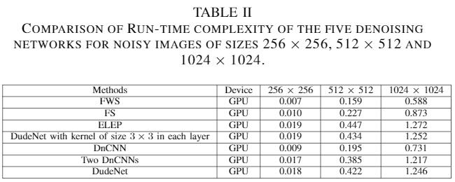
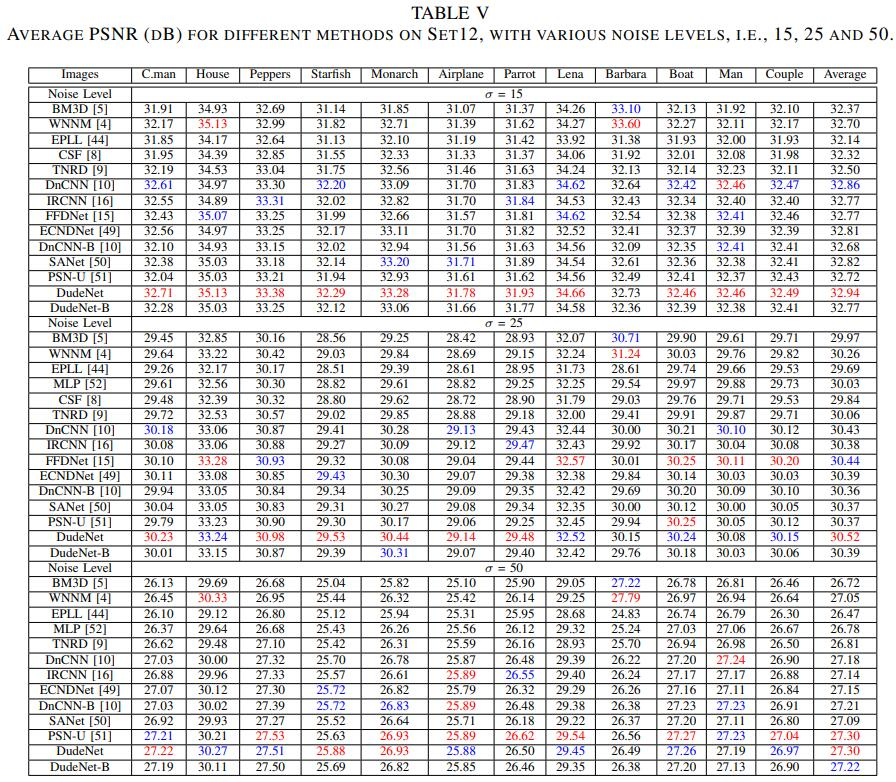
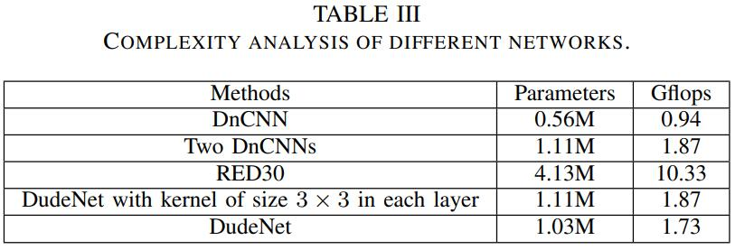
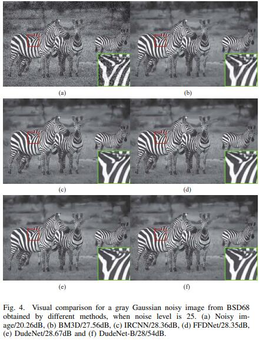

# DudeNet
## Designing and Training of A Dual CNN for Image Denoising 
## This paper is conducted by Chunwei Tian, Yong Xu, Wangmeng Zuo, Bo Du, Chia-wen Lin and David Zhang. It is implemented by Pytorch. And it is reported by Cver at https://wx.zsxq.com/mweb/views/topicdetail/topicdetail.html?topic_id=841142121551482&group_id=142181451122&user_id=28514284588581&from=timeline. And it is  by Knowledge-based Systems (IF:8.038) in 2021. It can be found on https://www.sciencedirect.com/science/article/abs/pii/S0950705121002124 and https://arxiv.org/pdf/2007.03951.pdf.

## Absract
### Deep convolutional neural networks (CNNs) for image denoising have recently attracted increasing research interest. However, plain networks cannot recover fine details for a complex task, such as real noisy images. In this paper, we propose a Dual denoising Network (DudeNet) to recover a clean image. Specifically, DudeNet consists of four modules: a feature extraction block, an enhancement block, a compression block, and a reconstruction block. The feature extraction block with a sparse mechanism extracts global and local features via two sub-networks. The enhancement block gathers and fuses the global and local features to provide complementary information for the latter network.The compression block refines the extracted information and compresses the network. Finally, the reconstruction block is utilized to reconstruct a denoised image. The DudeNet has the following advantages: (1) The dual networks with a parse mechanism can extract complementary features to enhance the generalized ability of denoiser. (2) Fusing global and local features can extract salient features to recover fine details for complex noisy images. (3) A Small-size filter is used to reduce the complexity of denoiser. Extensive experiments demonstrate the superiority of DudeNet over existing current state-of-the-art denoising methods.

## The codes are released next week. 

## Requirements (Pytorch)  
#### Pytorch 0.41
#### Python 2.7
#### torchvision 
#### openCv for Python
#### HDF5 for Python

## Commands
### Training
### Training datasets 
#### The  training dataset of the gray noisy images is downloaded at https://pan.baidu.com/s/1nkY-b5_mdzliL7Y7N9JQRQ or https://drive.google.com/open?id=1_miSC9_luoUHSqMG83kqrwYjNoEus6Bj (google drive)
#### The  training dataset of the color noisy images is downloaded at https://pan.baidu.com/s/1ou2mK5JUh-K8iMu8-DMcMw (baiduyun) or https://drive.google.com/open?id=1S1_QrP-fIXeFl5hYY193lr07KyZV8X8r (google drive) 

#### Test dataset of Set68 is downloaded at https://drive.google.com/file/d/1_fw6EKne--LVnW0mo68RrIY-j6BKPdSp/view?usp=sharing  (google drive) 

#### Test dataset of Set12 is downloaded at https://drive.google.com/file/d/1cpQwFpNv1MXsM5bJkIumYfww8EPtlkWf/view?usp=sharing  (google drive) 

#### Test dataset of CBSD68 is downloaded at https://drive.google.com/file/d/1lxXQ_buMll_JVWxKpk5fp0jduW5F_MHe/view?usp=sharing  (google drive) 

#### Test dataset of Kodak24 is downloaded at https://drive.google.com/file/d/1F4_mv4oTXhiG-zyG9DI4OO05KqvEKhs9/view?usp=sharing (google drive) 

#### The training dataset of real noisy images is downloaded at https://drive.google.com/file/d/1IYkR4zi76p7O5OCevC11VaQeKx0r1GyT/view?usp=sharing and https://drive.google.com/file/d/19MA-Rgfc89sW9GJHpj_QedFyo-uoS8o7/view?usp=sharing （google drive）

#### The test dataset of real noisy images  is downloaded at https://drive.google.com/file/d/17DE-SV85Slu2foC0F0Ftob5VmRrHWI2h/view?usp=sharing (google drive) 

### -------------------------------------------------------------------------------------------------------
### Train DudeNet-S or DuDeNet-B for gray image denoising 
### Copying training gray noisy images into DudeNet/gray/data
### Train DudeNet-S (DuDeNet with known noise level)
#### python train.py --prepropcess True --num_of_layers 17 --mode S --noiseL 25 --val_noiseL 25    

### Train DudeNet-B (DnCNN with blind noise level)
#### python train.py --preprocess True --num_of_layers 17 --mode B --val_noiseL 25

### Test DudeNet-S or DuDeNet-B for gray image denoising 
### Copying test gray noisy images into DudeNet/gray/data
### Test DudeNet-S (DuDeNet with known noise level)
#### python test.py --num_of_layers 17 --logdir gray_certrain_noise/g15 --test_data Set68 --test_noiseL 15 
### Test DudeNet-S for gray blind denoising
#### python test_b.py --num_of_layers 17 --logdir blind noise/ --test_data Set68 --test_noiseL 25   
### -------------------------------------------------------------------------------------------------------
### Train DudeNet-S or DuDeNet-B for color image denoising 
### Copying training color noisy images into DudeNet/color/data
### Train DuDeNet-S (DuDeNet with known noise level) for color image denoising
#### python train.py --prepropcess True --num_of_layers 17 --mode S --noiseL 25 --val_noiseL 25    

### Train DudeNet-B (DnCNN with blind noise level) for color image denoising 
#### python train.py --preprocess True --num_of_layers 17 --mode B --val_noiseL 25

### Test DudeNet-S or DuDeNet-B for color image denoising 
### Copying test color noisy images into DudeNet/color/data
### Color noisy images
#### python test_c.py --num_of_layers 17 --logdir certain_noise/c15 --test_data Set68 --test_noiseL 15 
### Color blind denoising
#### python test_gc.py --num_of_layers 17 --logdir color_blind_noise --test_data Set68 --test_noiseL 15  
### -------------------------------------------------------------------------------------------------------
### Train DuDeNet for real-noisy image denoising
### Copying training real noisy images into real_noisy/data
#### python train_r.py --prepropcess True --num_of_layers 17 --mode S --noiseL 25 --val_noiseL 25  
##### (Specifically, --val_noiseL 25 is not meaningful)  

### Test DuDeNet for real-noisy image denoising
### Copying test real noisy images into real_noisy/data 
#### python test_c.py --num_of_layers 17 --logdir real_model --test_data cc --test_noiseL 25 
##### (Specifically, --test_noiseL 25 is not meaningful) 
### -------------------------------------------------------------------------------------------------------
### 1. Network architecture

### 2. Real noisy images

### 3. Effectiveness of key techniques in the DudeNet for image denoising

### 4. Run-time of key techniques in the DudeNet for different sizes noisy images

### Test Results
#### 5. DudeNet for BSD68

#### 6. DudeNet for Set12

#### 7. DudeNet for CBSD68 and Kodak24

#### 8. DudeNet for real noisy images 

#### 9. Run-time of DudeNet for a noisy image of different sizes.

### 10.Complexity analysis of different networks.

#### 11. Visual results of Set12

#### 12. Visual results of BSD68

#### 13. Visual results of CBSD68

#### 14. Visual results of Kodak24 

### If you cite this paper, please refer to the following formats: 
#### 1.Tian, Chunwei, et al. "Designing and training of a dual CNN for image denoising." Knowledge-Based Systems 226 (2021): 106949.

#### 2. @article{tian2021designing,
#### title={Designing and training of a dual CNN for image denoising},
#### author={Tian, Chunwei and Xu, Yong and Zuo, Wangmeng and Du, Bo and Lin, Chia-Wen and Zhang, David},
#### journal={Knowledge-Based Systems},
#### volume={226},
#### pages={106949},
#### year={2021},
#### publisher={Elsevier}
#### }
